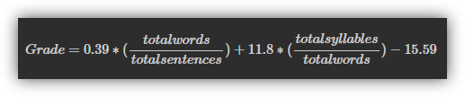
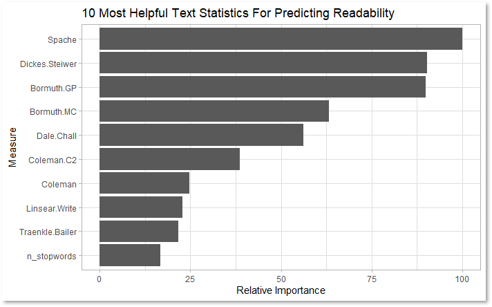

### What Makes Something Difficult to Read?

One of the most complicated (and interesting) challenges in Data Science is getting computers to understand text written by humans. Anyone could tell you that a passage from *War and Peace* is probably harder for most people to comprehend than a page out of *If You Give a Mouse a Cookie*, but how can we quantify the difference between the two? 

<center>


</center>

This question is especially relevant for CommonLit, an education nonprofit that focuses on improving youth literacy. CommonLit provides over 20 million students and teachers with free digital reading and writing lessons based on an impressive collection of books, poems, and articles in the public domain.

To ensure that students are assigned reading material that is appropriate for their skill level, these works need to be given a readability score. The problem, CommonLit asserts, is that existing methods of classifying readability are either cost-prohibitive or so reductive that they're insufficient. 

With an accurate, open-source method for evaluating the readability of a work, teachers would be able to ensure that their students are assigned suitably challenging work to improve their literacy skills. Students would also be able to receive feedback on the complexity and readability of their work, making it easier for them to improve their essential literacy skills.

My solution? Use machine learning techniques and natural language processing on a database of graded text excerpts from CommonLit to create a new, free method of evaluating text readability. The question boils down to "Which features of a text excerpt best predict its readability score?" 

If you've got a flight to catch, the short answer is that simple measures of text readability can be remarkably powerful when combined. Based on my findings, using a collection of readability measures in tandem resulted in **an improvement of over 15% in accurately determining readability** when compared to the most popular measure (Flesch-Kincaid Grade Level) alone. If you've got some time before your flight, though, read on: the comprehensive answer is a little more interesting.

### A Quick Overview: CommonLit Data and Regression Modeling

This project is made possible through CommonLit's sponsorship on Kaggle. If you'd like to learn more, the data for this project can be found at [this Kaggle link.](https://www.kaggle.com/c/commonlitreadabilityprize/overview) 

The competition sponsor poses the question “Can machine learning help align texts with students’ abilities to inspire learning?” For practical purposes, I want to know which machine learning model and feature set can best predict the target readability level of a passage. To help me answer these question, I have a training set of 2834 text excerpts and their associated readability scores (A number based on the average difficulty score given by multiple readers who rated the difficulty of reading each passage).

Because I will be predicting a numeric quantity, I’ll be relying on regression models. Regression analysis is a way to sort out how explanatory variables affect a response variable. For example, say we were deciding how to price a new house about to go on the market. **Explanatory variables** could include the number of bathrooms, the square footage, and whether the house has central heating. These features all have an impact on the **response variable**, the expected price of the house. 

In this case, my response variable is the [readability score](https://www.kaggle.com/c/commonlitreadabilityprize/discussion/240423) of each excerpt. I only have text data to predict with, so I’d expect every explanatory variable I create to be derived from the excerpts. That is, I'll be using characteristics of each passage to make guesses about how difficult the graders found the passage to read. I'll then be able to see which text characteristics have the strongest impact on readability and use them for accurate predictions.

### How Do You Measure Readability, Anyway?

There are a number of ways. Most reading scores are based on traditional readability methods or proprietary formulas that must be paid for. Perhaps the most ubiquitous score is the *Flesch-Kincaid Grade Level*, which is calculated using the total words, sentences, and syllables in a text. The result is a number that corresponds with the U.S. grade level of students for which the text is appropriate.

<center>



</center>

While this scoring system is helpful, it is not a comprehensive evaluation of reading complexity. Proprietary methods, like those used by market leader Lexile, offer a more thorough analysis of readability. The drawbacks with Lexile are that its methodology is opaque and it costs money to receive Lexile scores for any text excerpt longer than 250 characters. If you've got a tweet or other short passage you want analyzed, [you can use Lexile's free analyzer here.](https://hub.lexile.com/analyzer)

Because the Flesch-Kincaid Grade Level was once the standard for measuring readability, I'm going to use it as the baseline for how well my readability predictions perform. My goal is to use a combination of features (including Flesch-Kincaid) to improve prediction accuracy. 

To do this, I'll be generating explanatory variables from the text data based on popular measures of readability using the quanteda library in R. Think of quanteda as a toolbox for me to use that's packed with all the mathematical formulas I'd like to apply to the text data - Why use a rock to drive a nail when I've got a perfectly good hammer laying around?

### The Modeling Process

To recap, I'll be comparing the accuracy of two different models which evaluate readability: 

* The first model relies entirely on the Flesch-Kincaid Grade Level to assign readability scores to a passage
* The second, more comprehensive model uses a combination of measures to assign readability scores to a passage

The first step in the modeling process is to split the data into a training set and a testing set. From the entire collection of text excerpts and their associated difficulty scores, I put three quarters of the entries into a training set, and the remaining quarter into a testing set. This is done so that we can build a model based on information in the training set to make predictions with on the test set, treating them as data the model has never seen before. We can then score how accurately the model predicted readability because we have the associated difficulty scores for excerpts in our test set.

The next step is to create explanatory variables based on the text excerpts in our training set. Using tools like tidytext (which allows me to perform calculations on text data) and tm (which let be break apart the text excerpts into smaller components) along with quanteda for readability statistics let me create 34 explanatory variables.

Examples of features I created:  

* Frequency of dialogue and the word "said"
* Number of words, sentences, and filler words (stopwords)
* Proportion of filler words compared to all words
* A collection of 26 measures of readability based on academic articles

After enriching the dataset with explanatory variables, I randomly sampled the training data into five smaller sets. This process is called five-fold cross validation, and is designed to prevent my model from picking up on the quirks of one set of data that may not generalize to new information the model hasn't seen before. 

For example, if I built a weather machine that predicts whether it will rain on a given day, but only fed it weather data from this summer in Oregon, it might predict that rain would never come! It's good practice to proactively mitigate the quirks of data through resampling.

I then fit (train) a linear regression model on each of the folds and assess each sub-model's performance in predicting readability. To avoid cherry picking which of the five sub-models performed best, I take the average of my quality metric, RMSE, across the five. 

RMSE stands for "Root Mean Squared Error" and is a measure of how far off my predictions were from the actual difficulty score on average. An RMSE of zero, although practically impossible, would mean that the model predicted readability perfectly every time. In general, a lower score is desirable because it indicates a more accurate model. With RMSE calculated, we can compare the accuracy of the Flesch-Kincaid model and the comprehensive model.

### Results and Variable Importance

I began this project with the expectation that a comprehensive model would be more powerful at predicting readability than one that just relied on the Flesh-Kincaid Grade Level. I expected this because the addition of explanatory variables to a model increases the amount of information available for the model to make predictions with. It's typically true that one can make better decisions if they have more complete information to work with.

My expectations were met: the comprehensive model performed better than the Flesch-Kincaid model with a reduction in RMSE of 15.84%. R-squared, a number that indicates what percentage of variaton in the response variable is explained by the explanatory variables, also rose from explaining around a quarter of variation to explaining half of it.

```{r echo=FALSE, message=FALSE, fig.align='center'}
library(tidyverse)
library(kableExtra)
Metrics <- read.csv("C:/Users/srich/iCloudDrive/@ MSDS Round 3/2. Capstone Project/Project/Metrics.csv")
Metrics <- Metrics %>% rename(Model = `ï..Model`, `R^2` = R.squared)
kable(Metrics)
```

Mapping variable importance gives us a look at which of the explanatory variables were most relevant for predicting readability. Surprisingly, some of the most powerful metrics like the Dickes-Steiwer (1977) number centered on calculations of average word and sentence length. Another component for predicting readability was the proportion of unique, challenging words in an excerpt, based on Spache (1952). 



Unfortunately, my favorite metric based on the average score of an excerpt's words when played in Scrabble didn't make it to the top of the list. To learn more about the formulas used, [here is a link to documentation on how they were calculated.](https://quanteda.io/reference/textstat_readability.html)

### Reading Into Things

In this project I was able to demonstrate that there are ways to model readability more accurately than the Flesch-Kincaid Grade Level system, at no extra cost. Although readability metrics are sometimes criticized for relying on syntactic complexity and measures of word and sentence length, there is promise in using combinations of readability metrics to improve accuracy.

There are some limitations to using my method. Most notably, the parsimony of my comprehensive model is sacrificed for an improvement in RMSE and R-squared. There's something to be said for how easy it is to understand a model, and the high dimensionality of the comprehensive model makes it tough to interpret. With only one variable in the simple Flesch-Kincaid model, it's difficult to misinterpret. 


